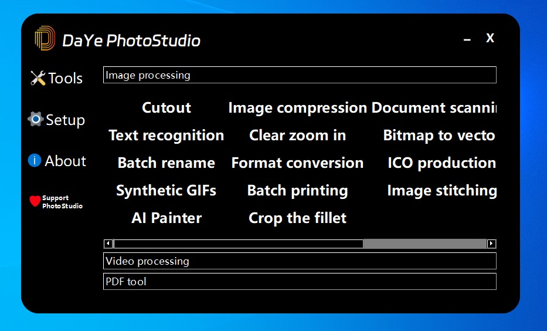
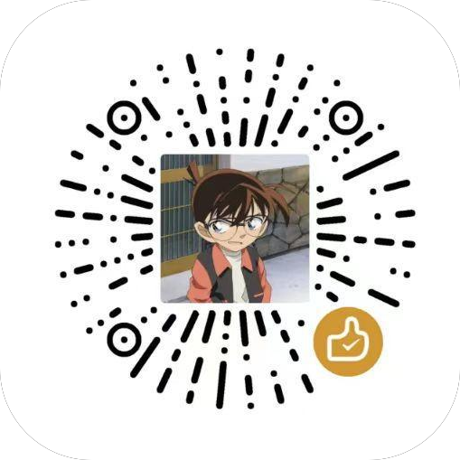

# DaYe PhotoStudio
## Download
You can download the compiled distro from the Quark network disk [here](https://pan.quark.cn/s/6d1890485c69).
## Software features:
- This program is completely free and requires no registration or login.
- When it comes to privacy, everything is run 100% local. No network required to run the model, no data sent to the cloud.
- This program only runs on the CPU and does not require a GPU.
## Preview：

## List of features:
### Image Processing:
| Function              | Remark                                                                                                                                              |
|-----------------------|-----------------------------------------------------------------------------------------------------------------------------------------------------|
| RemoveBG              | None                                                                                                                                                |
| Image compression     | None                                                                                                                                                |
| Document scanning     | Only English or numeric paths are supported.                                                                                                        |
| Form recognition      | Only English or numeric paths are supported.                                                                                                        |
| Text recognition      | None                                                                                                                                                |
| Clear zoom in         | None                                                                                                                                                |
| Bitmap to vector      | None                                                                                                                                                |
| Modify the dimensions | None                                                                                                                                                |
| Batch rename          | None                                                                                                                                                |
| Format conversion     | None                                                                                                                                                |
| ICO production        | None                                                                                                                                                |
| Split GIFs            | None                                                                                                                                                |
| Synthetic GIFs        | None                                                                                                                                                |
| Batch printing        | None                                                                                                                                                |
| Image stitching       | None                                                                                                                                                |
| Image rotation        | None                                                                                                                                                |
| AI Painter            | This program runs completely locally, so the speed of running depends entirely on your hardware.The V 100 can render the desired image in less than a minute.It may be unresponsive, but it's still running, just wait. |
| Crop the fillet       | None                                                                                                                                                |
### Video processing：
| Function           | Remark |
|--------------------|--------|
| Export frames      | Only English or numeric paths are supported.   |
| Video compositing  | Only English or numeric paths are supported.   |
### PDF tools:
| Function                     | Remark |
|------------------------------|--------|
| Image to PDF                 | None   |
| PDF to picture               | None   |
| PDF to Word                  |None   |
| PDF printer                  |None   |
| PDF rotation                 |None   |
| PDF splitting                |None   |
| PDF Merge                    |None   |
| Add page numbers to the PDF  |None   |
## Build from source code
### Operating Environment:
- Python 3.8.x
### How to build:
Start by creating a virtual environment
```commandline
python -m venv myenv
```
Then use an IDE such as Pycharm or vscode to open the directory where `myenv` is located to enter the environment.
Once you're in the virtual environment, you'll need to update the pip first.
```commandline
pip install --upgrade pip
```
Then you'll need to download the required third-party libraries.We recommend that you use Alibaba Cloud sources.You can run the `pip config set global.index-url http://mirrors.aliyun.com/pypi/simple` and `pip config set install.trusted-host mirrors.aliyun.com` operations to replace the original PIP with the source of the Alibaba Cloud instance.
```commandline
pip install -r requirements.txt
```
Once all the third-party libraries are installed, you will need to download the model file [from here](https://pan.quark.cn/s/e666deae4354). And move `.paddleocr` and `.paddlehub` to the `tools2` folder and `.u2net` to the `tools` folder.You can also delete the models you don't need to reduce the volume.
- Once you have done that, you can start the project by running `DPS_Main.py`.
## Develop DaYe PhotoStudio

Thank you so much for your support! Your support will help us to continuously improve and provide better services.
